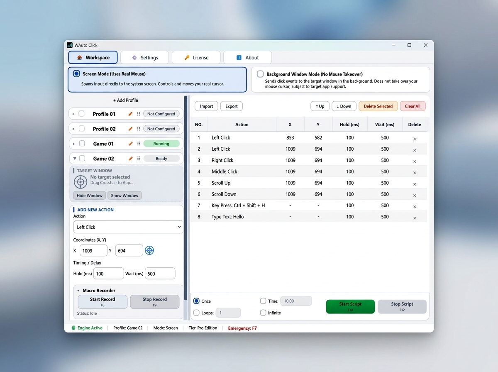
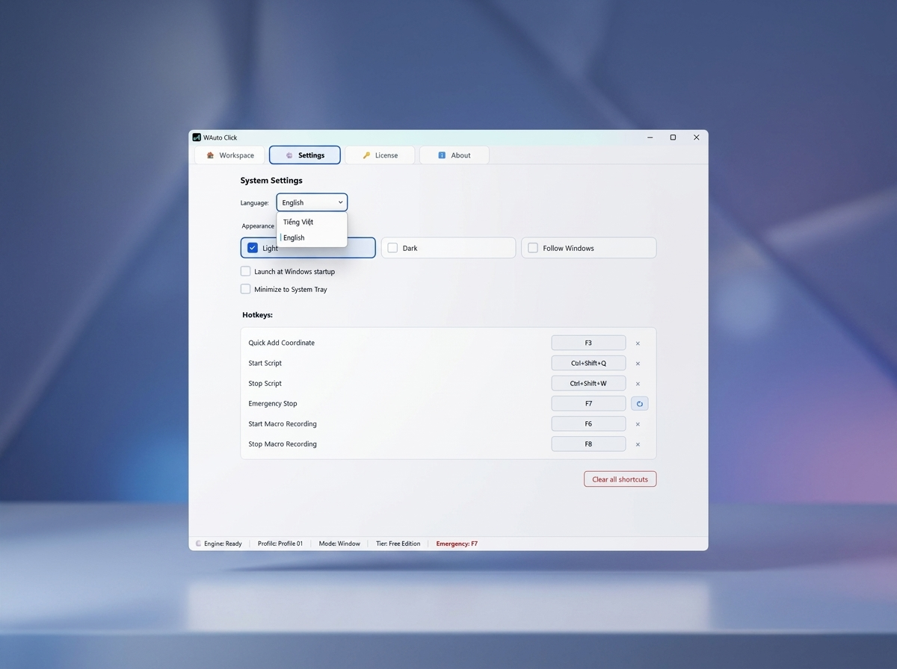
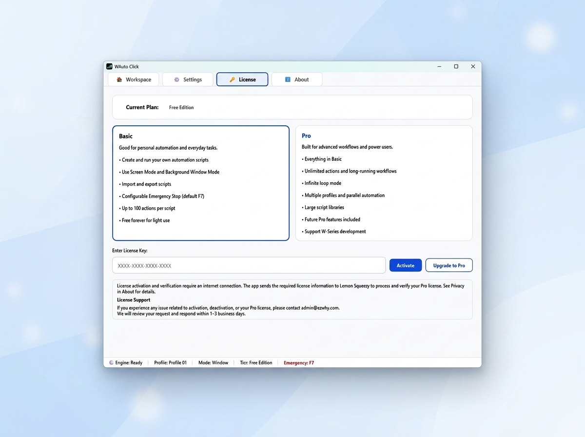
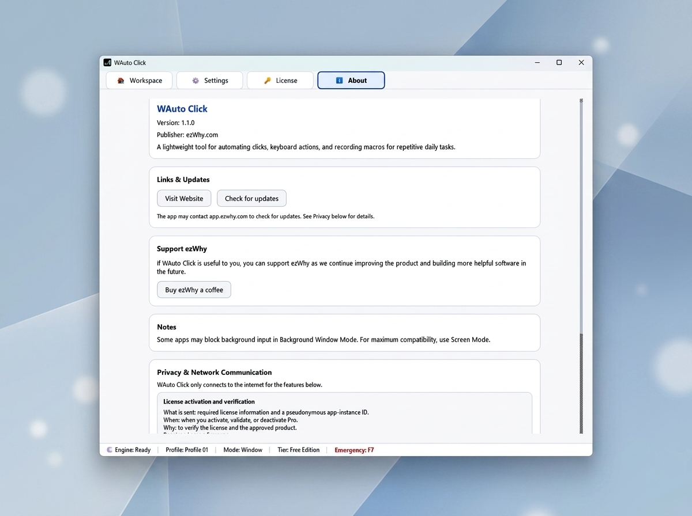

# WAuto Click

A lightweight Windows automation tool for clicks, keyboard actions, and simple macro workflows.

WAuto Click helps automate repetitive mouse and keyboard tasks without unnecessary complexity. Create automation scripts, record macros, organize multiple workflows, and let your computer handle repetitive actions while you focus on more important work.

---

## Features

### Mouse Automation

- Left Click
- Right Click
- Middle Click
- Scroll Up
- Scroll Down

### Keyboard Automation

- Key Press
- Type Text
- Configurable hotkeys

### Workflow

- Create automation scripts
- Macro Recorder
- Import / Export scripts
- Adjustable delay and hold time
- Screen Mode
- Background Window Mode*
- Emergency Stop
- Multiple languages (English / Vietnamese)
- Light / Dark / Follow Windows theme

> *Background Window Mode depends on whether the target application supports background input.

---

## Basic vs Pro

| Feature | Basic | Pro |
|---------|:-----:|:---:|
| Create and run automation scripts | ✅ | ✅ |
| Screen Mode | ✅ | ✅ |
| Background Window Mode | ✅ | ✅ |
| Mouse / Keyboard / Text / Scroll actions | ✅ | ✅ |
| Macro Recorder | ✅ | ✅ |
| Import / Export scripts | ✅ | ✅ |
| Custom Hotkeys | ✅ | ✅ |
| Emergency Stop (F7 by default) | ✅ | ✅ |
| Light / Dark / Follow Windows | ✅ | ✅ |
| English / Vietnamese | ✅ | ✅ |
| Profiles | 1 | Unlimited |
| Rename Profiles | ❌ | ✅ |
| Advanced Profile Management | Limited | ✅ |
| Actions per Script | Up to 100 | More Flexible |
| Infinite Loop | ❌ | ✅ |
| Run Multiple Profiles | ❌ | ✅ |
| Long Automation Workflows | Limited | ✅ |
| Future Pro Features | ❌ | ✅ |

---

## Screenshots

### Workspace

### Settings

### License

### About

---

## Why WAuto Click?

Many auto clickers focus on doing one thing—clicking repeatedly.

WAuto Click was built with a broader goal.

Instead of only automating clicks, it provides a simple workspace where you can combine mouse actions, keyboard input, delays, text typing, and macros into reusable automation scripts.

The goal is not to create the most feature-packed automation software.

The goal is to provide a clean, lightweight, and reliable tool that feels comfortable to use every day.

---

## Privacy

WAuto Click works locally on your computer.

An internet connection is only required for:

- License activation
- License validation
- Checking for updates

The application does **not** upload your automation scripts or personal files.

---

## Download

Official Website

https://app.ezwhy.com/wauto-click/

---

## Support

If WAuto Click is useful to you, consider upgrading to Pro or supporting the development of W-Series applications.

Thank you for supporting independent software.

---

## License

Copyright © ezWhy.

All rights reserved.
